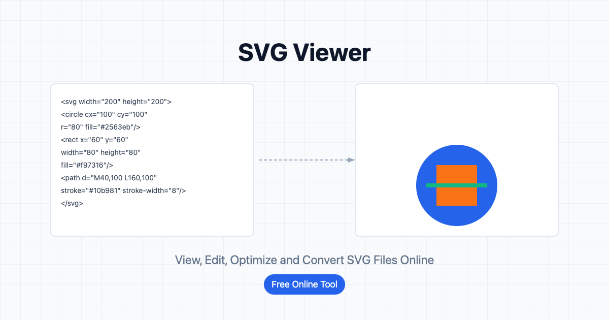

# SVG Viewer

A powerful SVG toolkit that helps developers and designers view, optimize, and convert SVG files.



## Features

- **SVG Viewer**: Real-time preview and edit SVG code
- **SVG Optimizer**: Reduce SVG file size, improve performance
- **SVG Converter**: Convert SVG to other formats (such as PNG, JPG, etc.)
- **Code Editor**: Built-in syntax highlighting SVG code editor
- **Real-time Preview**: Instantly view SVG editing effects
- **Zoom Control**: Adjust SVG preview size
- **File Import/Export**: Upload SVG files and download optimized results
- **Responsive Design**: Adapts to various device screens

## Tech Stack

- [Next.js](https://nextjs.org/) - React framework
- [TypeScript](https://www.typescriptlang.org/) - Type-safe JavaScript
- [Tailwind CSS](https://tailwindcss.com/) - Utility-first CSS framework
- [Radix UI](https://www.radix-ui.com/) - Accessible UI components
- [Prism.js](https://prismjs.com/) - Code syntax highlighting
- [Lucide React](https://lucide.dev/) - Icon library

## Quick Start

### Prerequisites

- Node.js 18.x or higher
- npm or yarn or pnpm

### Installation

1. Clone the repository

```bash
git clone https://github.com/yourusername/svg-viewer.git
cd svg-viewer
```

2. Install dependencies

```bash
npm install
# or
yarn install
# or
pnpm install
```

3. Start the development server

```bash
npm run dev
# or
yarn dev
# or
pnpm dev
```

4. Open your browser and visit [http://localhost:3000](http://localhost:3000)

## Usage Guide

### SVG Viewer

1. Enter or paste SVG code in the code editor
2. View the SVG in real-time in the preview window on the right
3. Use the zoom slider to adjust the preview size
4. Adjust the canvas size to accommodate different SVGs

### SVG Optimizer

1. Upload an SVG file or enter SVG code in the editor
2. Click the "Optimize" button
3. View the file size comparison before and after optimization
4. Download the optimized SVG file

### SVG Converter

1. Upload an SVG file or enter SVG code in the editor
2. Select the target format (PNG, JPG, etc.)
3. Set output options (size, quality, etc.)
4. Click the "Convert" button
5. Download the converted file

## Deployment

The project can be easily deployed to Vercel, Netlify, or other platforms that support Next.js:

```bash
# Build for production
npm run build
# or
yarn build
# or
pnpm build

# Start production server
npm start
# or
yarn start
# or
pnpm start
```

## Contribution Guidelines

Contributions are welcome! Feel free to submit issues or pull requests.

1. Fork the project
2. Create your feature branch (`git checkout -b feature/amazing-feature`)
3. Commit your changes (`git commit -m 'Add some amazing feature'`)
4. Push to the branch (`git push origin feature/amazing-feature`)
5. Open a Pull Request

## License

This project is licensed under the MIT License - see the [LICENSE](LICENSE) file for details

## Contact

Project Maintainer - [@sing1ee](https://github.com/sing1ee)

Project Link: [https://github.com/sing1ee/svg-viewer](https://github.com/sing1ee/svg-viewer) 